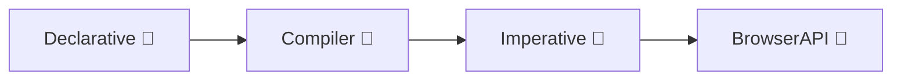

# SVELTE  A Disguised Transpiler

> _Look, another web-component generator! So, like React, Angular, Vue? ... or is it?_

==Oh, it's different==, `Svelte` is a _compiler_, and this is what seperates it from its component-generating counterparts. React, Angular, and Vue ship a JavaScript runtime to the browser as a means of functioning.

`Svelte` is described as being like "HTML, with some inline JavaScript sprinkled in".

#### The  Pipeline



> _High Performance, Small Package_

`Svelte` files are composed of a couple parts, or sections.

- The **first** section is composed of either `JavaScript`   or `TypeScript`   - your functions, logic, whatever...
- **Section two** is composed of  `CSS` or `SCSS` (SASS).
- **Section three** is just  HTML, though it will likely be highly extensed with `{components}`, making it look unlike regular on-page HTML.

Main features consist of **Reactive State**, **Conditionals**, **Cross-Component Communication**, **Component Trees**.

> [!WARNING]
> [Svelte 5](https://svelte.dev/) brought _a lot_ of changes to the ecosystem that, I'm assuming, are going to muddy the waters a bit on _the way_ to do some things. `Svelte5` was released October 2024, so it's probably wise to source learning materials from anytime _since_ then, none prior.

_Check out the [Svelte Playground](https://svelte.dev/playground/). It really is informative._

---

### Not That Kind of React

```ts
<script>
	let count = $state(0);
	function increment() {
		count += 1;
	}
</script>

<button onclick={increment}>
	clicks: {count}
</button>
```

↑ That is a button that increments by click count. Below is the resulting JavaScript output from the compiling of the above `Svelte`.

```ts
import 'svelte/internal/disclose-version';
import * as $ from 'svelte/internal/client';

function increment(_, count) {
	$.set(count, $.get(count) + 1);
}

var root = $.from_html(`<button> </button>`);

export default function App($$anchor) {
	let count = $.state(0);
	var button = root();
	button.__click = [increment, count];
	var text = $.child(button);
	$.reset(button);
	$.template_effect(() => $.set_text(text, `clicks: ${$.get(count) ?? ''}`));
	$.append($$anchor, button);
}
$.delegate(['click']);
```

> _Svelte's online playground will also display the compiled CSS and AST for an even more thorough breakdown._

```admonish info
With `React`, this would obviously work quite a bit differently. With each click, `React` would need to use the runtime to execute that function again.

This is not the case in `Svelte`! Instead, when a prop changes, the function does not need to be executed again and again. _Values_ are the dynamically changing asset; thereby, negating the need for re-rendering of the page.
```

Overall, a huge benefit here over other libraries/frameworks, is that the resulting JS is ACTUALLY READABLE. Compiled JS from these other options often looks like a fucking catastrophe. Svelte's compilation outputs the same kind of JS that a developer would physically type by hand.

> _Much of the frustration that I see with webdev/javascript programming appears to be acknowledged within Svelte's design. This library looks like its partial intention is to bring the user closer to the underlying JS without annihilating the readability of the compiled result, or obfuscating the underlying JavaScript - as if JS needed to be abstracted any more than it already has been. Purposeful and efficient, Svelte optimizes your web workflow by handling boilerplate and complexity that wouldn't be difficult to write on your own - it would just be very, very time-consuming in light of using this option instead._
>> "I care less for tools that smooth the trivial, and more for those that illuminate the intricate."

#### Three Birds, One Stone

I'll reiterate, **HTML, CSS, & JS can written in one single Svelte file**. Three languages, one `App.svelte`. Components are meant to be pluggable, and here Svelte maximizes your ability to retain a personal library of unique components that don't need significant debugging time to get running properly when introduced to a new environment.

Below is an example of a svelte file that has its HTML fused with CSS styling. We'll use the button from above:

```ts
<style>
	button {
		background: blue;
	}
</style>
```

CSS will be generated in coordination with what was declared in the Svelte file. Furthermore, unless specified, Svelte will generate a custom name for the class of the object to complement it:

```css
button.svelte-1cxlbia {
	background: blue;
}
```

## Install

> Must-have `node` version higher than `20.16.0` → _just update all your shit_

```bash
npx sv create
```

You will get three template choices: _minimal, demo, or library_ → Just pick minimal unless you want to fuck around in the demo. Then you will get the TypeScript options, **you should choose option one and focus on learning  as well**. It speeds things up, so just do it.

==Project Addtions== → default, always snag `prettier`/`eslint`/`storybook` - other good options include `tailwindcss` and `playwright`.

Now, to open, hit `yarn run dev --open`, becuase `npm` fucking blows ass and you shouldn't be using it.

By default, Svelte runs with server-side rendering; and therefore, is available within the page's `DOM` immediately.

Your `+page.svelte` file represents the literal page, with the active (desired) components imported from place like `Header.svelte` or whereever. The top of the file is a bit different though:

```ts
<script> // This is line one!
	import Header from './Header.svelte';
</script>

<Header />
```

> _Uppercase is a convention, not necessity. Still do it though!_

==What are Props?==

> Props are the vessel for communicating with and in-between components. If `Header.svelte` has a prop defined as such: `let { name } = $props();`, the new prop `{name}` is now a usable variable within the file **AND** in any file that Header is imported to, like `+page.svelte`.

```admonish bug
In  `VS Code`, ensure NOT to install `Svelte Intellisense` → it's deprecated garbage.
```

####  Support

Below is the method in which to access the `type` definitions for a `prop`. Also, in the script tag make sure to add `lang="ts"` within the tag to enable  .

```ts
let {
	name
}: {
	name: string;
	} = $props();
```
